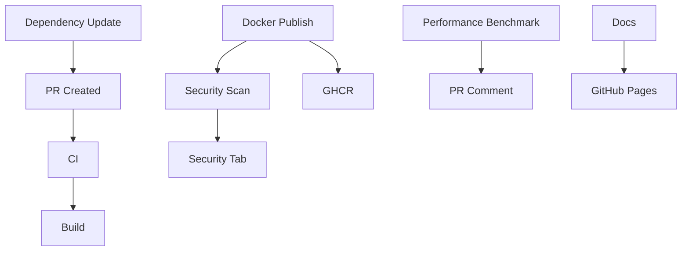

# GitHub Actions Workflows

Comprehensive CI/CD, security scanning, and automation workflows for SHAP Analytics.

## Overview

This directory contains enterprise-grade GitHub Actions workflows that provide:
- Continuous Integration and Testing
- Security Scanning and Vulnerability Management
- Automated Dependency Updates
- Docker Image Building and Publishing
- Performance Benchmarking
- Documentation Deployment

## Workflows

### 1. CI (`ci.yml`)

**Purpose**: Continuous Integration - code quality, testing, and build verification

**Triggers**:
- Push to `main` or `develop` branches
- Pull requests to `main` or `develop`
- Manual workflow dispatch

**Jobs**:

#### Lint
- Runs Ruff linter and formatter
- Checks code style compliance
- Annotates PRs with linting issues
- **Duration**: ~2-3 minutes

#### Type Check
- Runs MyPy strict type checking
- Generates HTML type check report
- Uploads report artifacts
- **Duration**: ~3-5 minutes

#### Test
- **Matrix**: Python 3.10, 3.11, 3.12 on Ubuntu/macOS/Windows
- Runs pytest with coverage
- Dependency compatibility tests
- Uploads coverage to Codecov
- Comments coverage on PRs
- **Duration**: ~5-10 minutes per matrix combination

#### Test-Slow
- Runs tests marked as "slow"
- Only on main/develop pushes
- Python 3.10 and 3.12 only
- **Duration**: ~15-30 minutes

#### Build
- Builds Python package with Poetry
- Validates package with twine
- Uploads build artifacts
- Auto-uploads to releases for tags
- **Duration**: ~2-3 minutes

#### CI Summary
- Aggregates all job results
- Posts summary to workflow
- Comments status on PRs
- Fails if any job fails

**Features**:
- ✅ Concurrency control (cancels outdated runs)
- ✅ Comprehensive caching (Poetry, pip, pytest, mypy, ruff)
- ✅ Multi-OS testing (Ubuntu, macOS, Windows)
- ✅ Codecov integration with PR comments
- ✅ Artifact retention (30-90 days)
- ✅ Automatic release uploads

**Configuration**:
```yaml
env:
  POETRY_VERSION: "1.7.1"
  PYTHON_DEFAULT_VERSION: "3.10"
```

**Required Secrets**:
- `CODECOV_TOKEN` - Codecov upload token

---

### 2. Security Scan (`security-scan.yml`)

**Purpose**: Comprehensive security analysis and vulnerability scanning

**Triggers**:
- Push to `main` or `develop`
- Pull requests
- Daily at 2 AM UTC (scheduled)
- Manual workflow dispatch

**Jobs**:

#### Bandit
- Python security linting
- Detects common security issues
- Medium+ severity, medium+ confidence
- Uploads JSON/text reports

#### Safety
- Dependency vulnerability scanning
- Checks PyPI advisory database
- Scans exported requirements
- Flags critical vulnerabilities

#### CodeQL
- Advanced semantic code analysis
- Security and quality queries
- SARIF upload to GitHub Security tab
- Extended security query suite

#### Trivy Filesystem
- Scans source code for vulnerabilities
- Checks dependencies in filesystem
- SARIF upload to Security tab
- Critical/High/Medium severity

#### Trivy Configuration
- Infrastructure as Code scanning
- Checks Docker, YAML configs
- Detects misconfigurations
- SARIF upload to Security tab

#### Trivy Docker
- Scans Docker image for vulnerabilities
- OS and application vulnerabilities
- Base image security checks
- SARIF upload to Security tab

#### Semgrep
- Static analysis security testing
- Pattern-based vulnerability detection
- SARIF upload to Security tab
- Auto rules from Semgrep registry

#### Pip-audit
- Python package vulnerability audit
- Uses OSV database
- JSON report generation
- Complementary to Safety

#### Security Summary
- Aggregates all scan results
- Posts comprehensive summary
- Links to detailed reports
- Fails on critical issues

**Features**:
- ✅ Multiple security tools for comprehensive coverage
- ✅ Daily automated scans
- ✅ SARIF uploads to GitHub Security tab
- ✅ Detailed artifact reports
- ✅ Automated issue creation on failures
- ✅ Docker image security scanning

**Permissions**:
```yaml
permissions:
  contents: read
  security-events: write
  actions: read
```

**Scan Coverage**:
| Tool | Type | Coverage |
|------|------|----------|
| Bandit | SAST | Python code patterns |
| Safety | SCA | PyPI vulnerabilities |
| CodeQL | SAST | Semantic analysis |
| Trivy | SCA/IaC | Dependencies, configs, images |
| Semgrep | SAST | Pattern matching |
| Pip-audit | SCA | OSV database |

---

### 3. Dependency Update (`dependency-update.yml`)

**Purpose**: Automated dependency updates with testing

**Triggers**:
- Weekly on Mondays at 9 AM UTC
- Manual workflow dispatch with options

**Manual Options**:
- `update_type`: patch, minor, major, all
- `create_pr`: true/false

**Jobs**:

#### Check Updates
- Scans for outdated dependencies
- Generates update summary
- Outputs list of available updates
- Uploads outdated packages list

#### Update Dependencies
- **Matrix Strategy**: Updates by group
  - `core-dependencies`: numpy, pandas, scikit-learn, shap, scipy
  - `api-dependencies`: fastapi, uvicorn, pydantic, starlette
  - `dev-dependencies`: pytest, mypy, ruff, pre-commit
  - `visualization-dependencies`: matplotlib, plotly

- For each group:
  - Updates specified packages
  - Runs full test suite
  - Runs security checks
  - Creates branch and commits
  - Opens PR if tests pass

#### Poetry Update
- Updates Poetry lock file
- Resolves dependency conflicts
- Runs quick test suite
- Creates PR for lock updates

#### Update Summary
- Aggregates update results
- Posts summary to workflow
- Creates issue on failures
- Links to created PRs

**Features**:
- ✅ Grouped dependency updates
- ✅ Automated testing before PR
- ✅ Security scanning of updates
- ✅ Separate PRs per group
- ✅ Configurable update types
- ✅ Auto-labeling of PRs

**Update Groups**:
```yaml
matrix:
  update-group:
    - name: 'core-dependencies'
      packages: 'numpy pandas scikit-learn shap scipy'
    - name: 'api-dependencies'
      packages: 'fastapi uvicorn pydantic starlette'
    # ... etc
```

**PR Labels**:
- `dependencies`
- `automated`
- `{group-name}`

---

### 4. Docker Publish (`docker-publish.yml`)

**Purpose**: Build, scan, and publish multi-architecture Docker images

**Triggers**:
- Push to `main` or `develop`
- Tags matching `v*.*.*`
- Pull requests (build only, no push)
- Manual workflow dispatch

**Jobs**:

#### Build and Test
- Builds Docker image for testing
- Runs health check tests
- Scans with Trivy
- Uploads SARIF to Security tab
- Fails on critical vulnerabilities

#### Build Multi-arch
- **Platforms**: linux/amd64, linux/arm64
- Uses QEMU for cross-compilation
- Builds separate platform images
- Uploads image artifacts
- Uses Docker layer caching

#### Publish
- Combines multi-arch images
- Pushes to GitHub Container Registry (GHCR)
- Creates image manifest
- Generates build provenance attestation
- Tags: latest, version, sha, branch

#### Scan Published
- Pulls published images
- Scans with Trivy and Grype
- Uploads results to Security tab
- Checks latest and develop tags

#### Update README
- Creates Docker registry README
- Documents image usage
- Lists available tags
- Updates container description

#### Summary
- Posts build summary
- Shows published tags
- Links to images
- Creates issue on failure

**Features**:
- ✅ Multi-architecture support (amd64, arm64)
- ✅ Docker layer caching for speed
- ✅ Security scanning before and after publish
- ✅ Build provenance attestation
- ✅ Automatic tagging strategy
- ✅ GHCR integration
- ✅ Failure notifications

**Image Tags**:
```yaml
tags:
  - type=ref,event=branch        # main, develop
  - type=semver,pattern={{version}}  # 0.1.0
  - type=semver,pattern={{major}}.{{minor}}  # 0.1
  - type=semver,pattern={{major}}  # 0
  - type=sha,prefix={{branch}}-   # main-abc123
  - type=raw,value=latest         # latest (main only)
```

**Registry**: `ghcr.io/${{ github.repository }}`

**Required Secrets**:
- `GITHUB_TOKEN` (automatic)

---

### 5. Performance Benchmark (`performance-benchmark.yml`)

**Purpose**: Track and monitor performance metrics

**Triggers**:
- Pull requests to `main` or `develop`
- Push to `main`
- Manual workflow dispatch

**Jobs**:

#### Benchmark
- SHAP computation benchmarks
- Memory usage profiling
- Drift detection performance
- API throughput testing
- Baseline comparison
- PR comments with results

**Features**:
- ✅ Regression detection
- ✅ Baseline caching
- ✅ PR performance reports
- ✅ JSON artifact storage
- ✅ Performance thresholds

**Thresholds**:
- SHAP 100 samples: < 2s
- SHAP 1K samples: < 10s
- API single request: < 1s
- Drift detection: < 5s

---

### 6. Documentation (`docs.yml`)

**Purpose**: Build and deploy MkDocs documentation

**Triggers**:
- Push to `main`
- Manual workflow dispatch

**Jobs**:
- Builds MkDocs site
- Deploys to GitHub Pages
- Updates documentation site

---

### 7. TODO to Issues (`todo.yml`)

**Purpose**: Convert TODO comments to GitHub issues

**Triggers**:
- Push to any branch
- Manual workflow dispatch

**Jobs**:
- Scans code for TODO/FIXME comments
- Creates GitHub issues automatically
- Links to code locations
- Avoids duplicates

---

## Caching Strategy

All workflows use comprehensive caching for faster execution:

### Poetry Dependencies
```yaml
- uses: actions/cache@v4
  with:
    path: .venv
    key: venv-${{ job }}-${{ runner.os }}-py${{ python-version }}-${{ hashFiles('**/poetry.lock') }}
    restore-keys: |
      venv-${{ job }}-${{ runner.os }}-py${{ python-version }}-
```

### Tool-Specific Caches
- **MyPy**: `.mypy_cache`
- **Pytest**: `.pytest_cache`
- **Ruff**: `~/.cache/ruff`
- **Pip**: Built-in pip cache
- **Docker**: GitHub Actions cache layers

## Security

### SARIF Uploads
All security tools upload SARIF results to GitHub Security tab:
- CodeQL Analysis
- Trivy (Filesystem, Config, Docker)
- Semgrep
- Grype

### Permissions
Workflows use minimal required permissions:
```yaml
permissions:
  contents: read
  security-events: write  # For SARIF uploads
  packages: write  # For Docker publishing
```

### Secrets Management
Required secrets:
- `CODECOV_TOKEN` - Codecov uploads (optional)
- `GITHUB_TOKEN` - Automatic (for most operations)

## Workflow Dependencies



## Best Practices

### 1. Concurrency Control
```yaml
concurrency:
  group: ${{ github.workflow }}-${{ github.ref }}
  cancel-in-progress: true
```
Prevents wasted compute on outdated commits.

### 2. Fail-Fast Strategy
```yaml
strategy:
  fail-fast: false
  matrix:
    # ...
```
Allows all matrix jobs to complete for comprehensive results.

### 3. Timeout Protection
```yaml
timeout-minutes: 30
```
Prevents runaway jobs from consuming resources.

### 4. Artifact Retention
```yaml
retention-days: 30  # or 90 for important artifacts
```
Balances storage costs with debugging needs.

### 5. Conditional Execution
```yaml
if: github.event_name == 'push' && github.ref == 'refs/heads/main'
```
Optimizes workflow runs based on context.

## Monitoring

### Workflow Status
Check workflow status:
- GitHub Actions tab
- Commit status checks
- PR comments
- Email notifications (if configured)

### Artifacts
Download artifacts for detailed analysis:
- Test results (JUnit XML)
- Coverage reports (HTML)
- Security scan results (JSON/SARIF)
- Build artifacts (wheel, sdist)
- Performance benchmarks (JSON)

### GitHub Security Tab
View all security findings:
1. Navigate to repository Security tab
2. Click "Code scanning alerts"
3. Filter by tool, severity, or status
4. Review and dismiss as needed

## Troubleshooting

### Cache Issues
If cache causes problems:
```bash
# Clear cache by changing cache key
key: venv-v2-${{ runner.os }}-...
```

### Workflow Failures

#### Lint Failures
```bash
# Run locally
poetry run ruff check src/ tests/
poetry run ruff format --check src/ tests/
```

#### Test Failures
```bash
# Run with same flags
poetry run pytest -v --cov=src/shap_analytics -m "not slow"
```

#### Security Scan Failures
```bash
# Run locally
bandit -r src/
safety check
```

#### Docker Build Failures
```bash
# Test locally
docker build -t test .
docker run -p 8080:8080 test
```

### Common Issues

**Issue**: Dependency conflicts
**Solution**: Update `poetry.lock`, ensure NumPy < 2.0.0

**Issue**: Codecov upload failures
**Solution**: Check `CODECOV_TOKEN` secret exists

**Issue**: Docker layer cache misses
**Solution**: Ensure `cache-from/cache-to` uses consistent keys

**Issue**: Security scan false positives
**Solution**: Review and dismiss in Security tab

## Maintenance

### Weekly Tasks
- Review dependency update PRs
- Check security scan results
- Monitor workflow run times
- Review artifact storage usage

### Monthly Tasks
- Update workflow action versions
- Review and update caching strategies
- Optimize slow jobs
- Clean up old artifacts

### Quarterly Tasks
- Review workflow permissions
- Update security scanning tools
- Audit secrets and tokens
- Review performance benchmarks

## Contributing

When adding or modifying workflows:

1. Test locally when possible
2. Use minimal permissions
3. Add comprehensive comments
4. Update this README
5. Test in a PR first
6. Monitor first production run

## Resources

- [GitHub Actions Documentation](https://docs.github.com/en/actions)
- [Poetry Documentation](https://python-poetry.org/docs/)
- [Codecov Documentation](https://docs.codecov.com/)
- [Trivy Documentation](https://aquasecurity.github.io/trivy/)
- [Docker Buildx Documentation](https://docs.docker.com/buildx/)

## Support

For workflow issues:
1. Check workflow logs
2. Review this README
3. Search GitHub Issues
4. Create new issue with `ci/cd` label
